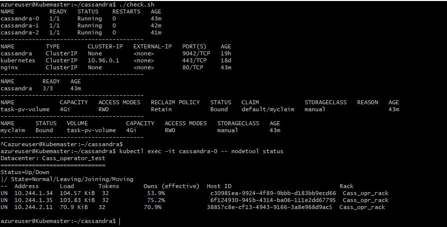

Aim of this project is to build an operator for Cassandra. To start with, the attached files were used to build 3 node cassandra ring on 3-node Kubernetes running on Azure.

First install Kubernetes on Azure VM with an additional non-shared disk mounted in mount point "/cassandra_data2" on all nodes. To install Cassandra execute ./create.sh which will install and give a working cassandra cluster.

This document will be updated as soon as we have further build in this.

 